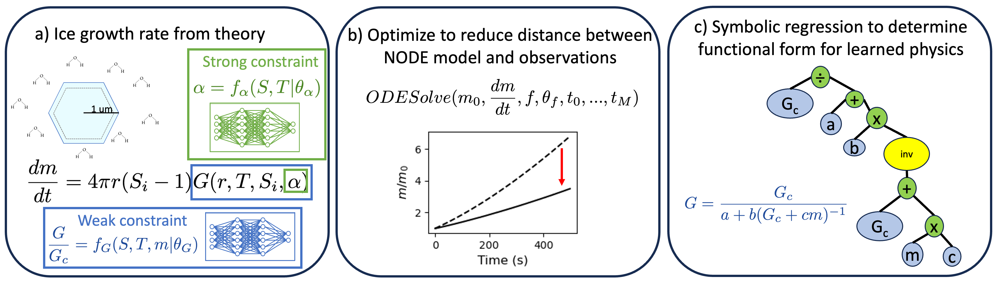

# IceNODE


## Overview
This github repo provides the analysis and code for a scientific machine learning analysis of depositional ice growth models. We provide a PyTorch implementation of the code for the paper "Discovering How Ice Crystals Grow Using Neural Ordinary Differential Equations and Symbolic Regression".  
Here we explore how neural ordinary differential equations and equation discovery can be applied to observations of times series of the mass of single ice crystals grown in a levitation diffusion chamber.

## Content
- [Data Preparation](#data-preparation)
- [NODE Model](#node-model)

## Data Preparation
Data sets for the levitation diffusion chamber experiments are described in [Pokrifka et al. 2020](https://journals.ametsoc.org/view/journals/atsc/77/7/jasD190303.xml) and [Pokrifka et al. 2023](https://journals.ametsoc.org/view/journals/atsc/80/2/JAS-D-22-0077.1.xml). 
The `preprocessing.py` script creates a pytorch data loader containing all experiments used in this analysis. 

Synthetic data for the levitation diffusion chamber experiments assumes a functional form the depositional ice growth model, and the script `synthetic_data.py` 
takes the initial conditions and detrended noise from the real experiments to initiate the synthetic data sets.

Data sets from the IsoCloud experiments in the AIDA Cloud Chamber are described in [Lamb et al. 2017](https://www.pnas.org/doi/10.1073/pnas.1618374114), [Clouser et al. 2020](https://acp.copernicus.org/articles/20/1089/2020/), and [Lamb et al. 2023](https://acp.copernicus.org/articles/23/6043/2023/). 
Pre-processing scripts for the AIDA data sets can be found [here](https://github.com/kdlamb/icedeposition).

## NODE Models
The `main.py` script is used for training the NODE model against the experimental observations or synthetic data sets and for finding a symbolic equation. It includes weak, medium, and strong assumptions for the physical constraints
used in the NODE model. The [torchdiffeq library](https://github.com/rtqichen/torchdiffeq) is used to implement the NODE models and the [PySR library](https://github.com/MilesCranmer/PySR) is used for symbolic regression. 

## Citation
The preprint for this paper can be found at:
```
@article{lamb2025discovering,
  title={Discovering How Ice Crystals Grow Using Neural ODE's and Symbolic Regression},
  author={Lamb, Kara D and Harrington, Jerry Y and Moyle, Alfred M and Pokrifka, Gwenore F and Clouser, Benjamin W and Ebert, Volker and M{\"o}hler, Ottmar and Saathoff, Harald},
  journal={arXiv preprint arXiv:2510.17935},
  year={2025}
}
```
